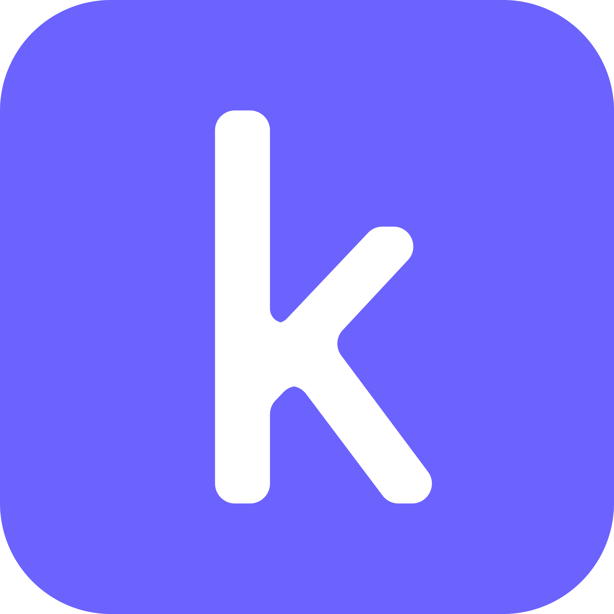

<!-- PROJECT LOGO -->
<br />
<p align="center">
  <a href="https://template.karngyan.com">
    
  </a>
  <br/><br/>
  <a href="https://template.karngyan.com">
    
  </a>

  <h3 align="center">template.karngyan.com</h3>

  <p align="center">
    Dark themed, SEO friendly: Nuxt Content + TailwindCSS + Firebase + i18n based SPA for <strong>procrastinating</strong> developers to quickly spin up their own kickass blog and showcase their projects.
  </p>
</p>


[![Product Name Screen Shot][product-screenshot]](https://template.karngyan.com)

Visit: [template.karngyan.com](https://template.karngyan.com) to see all feature enabled version of this template.

<!-- TABLE OF CONTENTS -->
<details open="open">
  <summary>Table of Contents</summary>
  <ol>
    <li><a href="#instructions-to-make-it-your-own">Instructions to make it your own</a></li>
    <li><a href="#other-deployment-options">Other Deployment Options</a></li>
    <li><a href="#contributing">Contributing</a></li>
    <li><a href="#awesome-forks-">Awesome Forks</a></li>
    <li><a href="#license">License</a></li>
    <li><a href="#contact">Contact</a></li>
  </ol>
</details>

<!-- USAGE EXAMPLES -->
## Instructions to make it your own

### Recommended [more like easiest and quickest way]

1. Fork the project.
2. Clone your copy and create your own branch out of it.
```bash
# replace <username> with your username
git clone git@github.com:<username>/karngyan.com.git
git checkout -b website
```
3. Choose your favorite editor and open the project.
4. Local development setup:
```bash
# install node <= 14 and yarn (highly recommended)
$ npm install --global yarn

# cd into your project and install the dependencies
$ yarn install

# run the dev server
$ yarn dev

# open localhost:3000
```
> Page might not load right now, you can set `firebase.enabled = false` in `karngyan.config.js` for now. Read along.

4. Edit `karngyan.config.js` to your liking. You can turn on and off sections/pages by changing the `enabled` value for respective objects.
    - You can add your images to `static` directory. It matches to root when deployed.
    - Update the `strings` object accordingly.
5. To enable comments and likes on blog posts and project posts, we use [Firebase](https://firebase.google.com/).
If you don't need that, set `firebase.enabled = false` in `karngyan.config.js`, and move to the next step. Otherwise follow these:
    - Create a firebase project.
    - Create a web app and get the firebase config object. (You can follow this [video](https://www.youtube.com/watch?v=k1D0_wFlXgo))
    - Enable Authorization (Google Provider supported as of now)
    - Enable Firestore
    - Set the following cloud firestore rules, so that your database is write protected:
      ```cel
      rules_version = '2';
      service cloud.firestore {
        match /databases/{database}/documents {
          match /likes/{id} {
            allow write: if request.auth != null;
            allow read: if true;
          }
          match /comments/{id} {
            allow write: if request.auth != null && 
              request.resourse.data.text.size() > 0 &&
              request.resource.data.slug.size() > 0;
            allow read: if true;
          }
        }
      }
      ```
    - This actually does open a security loophole of open reads and will increase your firebase bills for too many reads.
    - Only if you'll be testing locally
      - Create a copy of `.env.example` -> `.env` and add values from config object.
6. Deploy to netlify using the following config:
    - Repository: Your forked repository
    - Branch: `website`
    - Publish Directory: `dist`
    - Build Command: `yarn generate`
    - Don't forget to add all the environment variables if you have enabled firebase.
7. Write your blogs in `content/posts` and projects in `content/projects` in markdown or html. There's a couple of samples that come with the template.
8. Add to staging, Commit and Push.
    
The code is yours, edit whatever you feel like. Don't forget to star the repository if you liked it.

This project uses nuxt content, you can read about it [here](https://content.nuxtjs.org/)

You can also set up [forestry](https://forestry.io) to never open code and use a cool editor. I'll add instructions to use that later.

## Other Deployment Options

My own website [karngyan.com](https://karngyan.com) is actually deployed on AWS in an S3 bucket, with Cloudfront. But that comes with a few caveats to configure and maintain.
Anyways the gulpfile.js to deploy to AWS is committed with the project if you feel like you want to check it out.

<!-- CONTRIBUTING -->
## Contributing

Contributions are what make the open source community such an amazing place to be learn, inspire, and create. Any contributions you make are **greatly appreciated**.

1. Fork the Project
2. Create your Feature Branch (`git checkout -b feature/AmazingFeature`)
3. Commit your Changes (`git commit -m 'Add some AmazingFeature'`)
4. Push to the Branch (`git push origin feature/AmazingFeature`)
5. Open a Pull Request


## Awesome Forks ![Awesome][awesome-badge]

Raise a PR when your website's up to add you here. 
> Find your alphabetical position, or raise a PR to automate this.


* [Anamika Pandey](https://github.com/anamikapandey745) - [anamika.dev](https://anamika.dev)
* [Claudio Canales](https://github.com/klaudioz) - [klaudioz.eth](https://klaudioz.eth.link/)
* [Gyan Prakash Karn](https://github.com/gyankarn) - [karngyan.com](https://karngyan.com)
* [Nenad Radovanovic](https://github.com/nesaplay) - [nenad.xyz](https://nenad.xyz)

<!-- LICENSE -->
## License

Distributed under the MIT License. See `LICENSE` for more information.


<!-- CONTACT -->
## Contact

Karn - [@gyankarn](https://twitter.com/gyankarn) - mail@karngyan.com


<!-- MARKDOWN LINKS & IMAGES -->
<!-- https://www.markdownguide.org/basic-syntax/#reference-style-links -->
[license-shield]: https://img.shields.io/github/license/othneildrew/Best-README-Template.svg?style=for-the-badge
[license-url]: https://github.com/karngyan/karngyan.com/blob/template/LICENSE
[linkedin-shield]: https://img.shields.io/badge/-LinkedIn-black.svg?style=for-the-badge&logo=linkedin&colorB=555
[linkedin-url]: https://linkedin.com/in/karngyan
[product-screenshot]: assets/template.karngyan.com.png
[awesome-badge]: https://cdn.rawgit.com/sindresorhus/awesome/d7305f38d29fed78fa85652e3a63e154dd8e8829/media/badge.svg

For detailed explanation on how things work, check out [Nuxt.js docs](https://nuxtjs.org).
